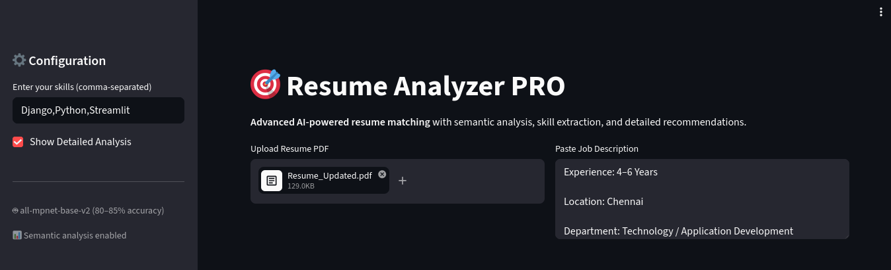
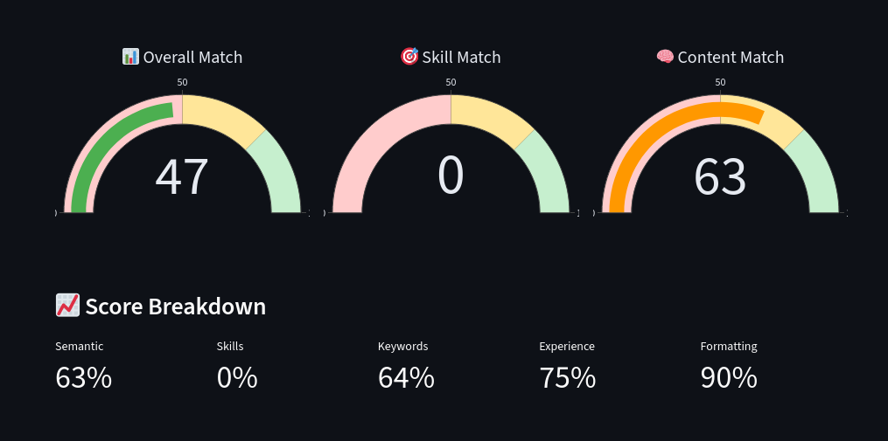
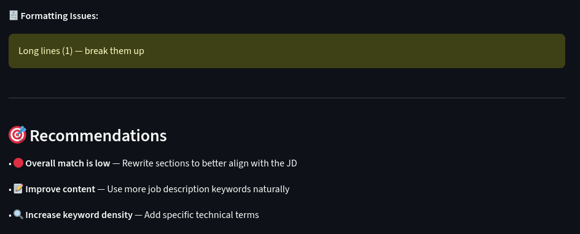
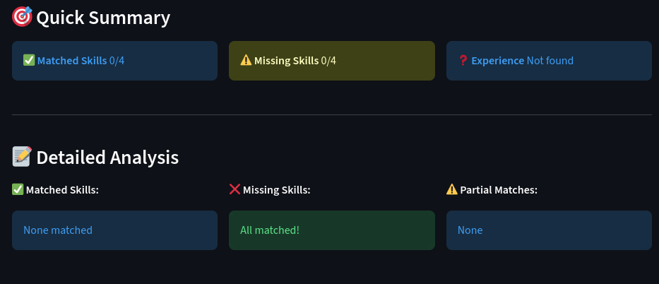
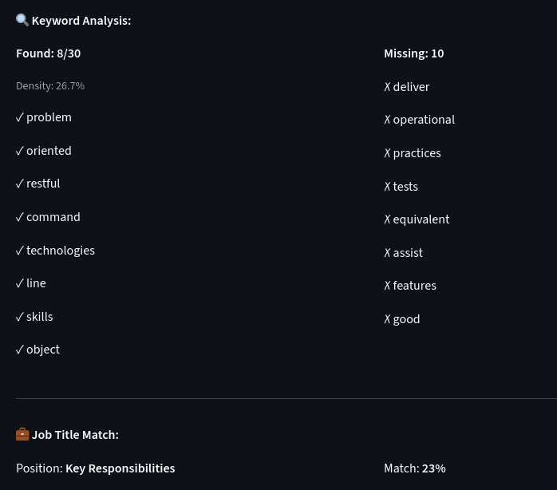

# 🎯 Resume Analyzer

An AI-powered resume matcher that scores how well your resume fits a job description — with skill gap analysis, keyword density, experience matching, and formatting feedback.

🔗 **Live Demo:** [huggingface.co/spaces/CallMeRolex/Resume-Analyzer](https://huggingface.co/spaces/CallMeRolex/Resume-Analyzer)

---

## 📸 Screenshots


**Overall match, skill match and content match gauges**


**Quick summary and detailed skill breakdown**


**Keyword analysis — found vs missing**


**Formatting issues and recommendations**


---

## ⚙️ Installation

**Prerequisites:** Python 3.9+

```bash
# 1. Clone the repo
git clone https://github.com/<your-username>/Resume.git
cd Resume

# 2. Create a virtual environment
python -m venv venv
source venv/bin/activate        # Windows: venv\Scripts\activate

# 3. Install dependencies
pip install -r requirements.txt

# 4. Run the app
streamlit run app.py
```

Open your browser at **http://localhost:8501**

> **Note:** First launch downloads the `all-mpnet-base-v2` model (~420MB). This only happens once.

---

## 🐳 Run with Docker

```bash
docker compose up --build
```

Open your browser at **http://localhost:8501**

---

## 📖 How to Use

**Step 1 — Enter your skills**
In the left sidebar, type your skills as a comma-separated list.
Example: `Python, Docker, AWS, FastAPI`

**Step 2 — Upload your resume**
Click "Upload Resume PDF" and select your resume. Must be a text-based PDF (not a scanned image).

**Step 3 — Paste the job description**
Copy the full job description from any job portal and paste it into the text box.

**Step 4 — Read your results**
The app generates an overall match score broken down into:

| Score | What it measures |
|-------|-----------------|
| 📊 Overall Match | Weighted combination of all scores below |
| 🧠 Semantic Match | How closely your resume content aligns with the JD |
| 🎯 Skill Match | Which of your listed skills appear in the JD |
| 🔍 Keyword Density | How many JD keywords are present in your resume |
| 📅 Experience | Whether your years of experience meet the requirement |
| 💼 Job Title | How well your role history aligns with the position |
| 🧾 Formatting | Bullet usage, line length, and consistency |

You'll also get a **Recommendations** section at the bottom with specific actions to improve your score.

---

## 📁 Project Structure

```
Resume/
├── app.py               # Main Streamlit application
├── requirements.txt     # Python dependencies
├── Dockerfile           # Docker image definition
├── docker-compose.yml   # Local Docker orchestration
└── README.md
```

---

## 🛠️ Tech Stack

| Tool | Purpose |
|------|---------|
| [Streamlit](https://streamlit.io) | Web UI |
| [sentence-transformers](https://www.sbert.net) | Semantic embeddings (`all-mpnet-base-v2`) |
| [PyMuPDF](https://pymupdf.readthedocs.io) | PDF text extraction |
| [Plotly](https://plotly.com) | Score gauge charts |

---

## 📄 License

MIT License
